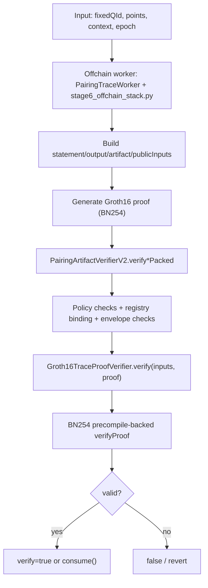

# P7_GAS_TABLES: Детализированный отчет по архитектуре `offchain precompute -> onchain verify`

## 1. Назначение документа

Документ описывает **только новую архитектуру (R4/R8/R5 + PC1..PC7 + P0..P7)**, где:

- тяжелая арифметика Tate/Ate pairing на `MNT4-753` выносится off-chain;
- on-chain выполняется компактная верификация криптографического доказательства корректности;
- контракт **не доверяет** переданному off-chain кэшу без проверок binding/commitment/proof.

Документ также содержит:

- актуальные сигнатуры и поведение ключевых контрактов;
- точное соответствие реализованных оптимизаций идеям из статей;
- канонические gas-метрики (tx receipt `gasUsed`) и unit-метрики;
- методику интерпретации результатов.

---

## 2. Что обновлено в этой версии

Относительно предыдущей версии отчета:

1. Актуализирован статус FE-оптимизации из ePrint 2024/640:
- в `stage6_input_binding.circom` внедрен **residue/relation FE mode** (`feChunk[3]`),
- в `generate_stage6_groth16_proof.py` добавлена генерация residue witness,
- обновлены fixture/proof и backend-замеры.

2. Актуализированы gas-таблицы по текущему состоянию кода:
- backend unit: ~`322k`;
- verify packed tx: ~`354k..359k`;
- consume tx: ~`404k..410k`;
- baseline old onchain: `68.9M..293.6M`.

3. Расширены пояснения по функциям и контрактам:
- добавлены назначения, security-checks, и влияние на gas.

4. Добавлена подробная матрица тестов и интерпретация каждого основного бенчмарка.

---

## 3. Архитектура и модель доверия

## 3.1 Инвариант доверия

On-chain код не доверяет:

- line-cache коэффициентам,
- FE-cache артефактам,
- trace/witness,
- внешнему proof payload.

On-chain код доверяет только тому, что:

1. `fixedQId` активен в `FixedQRegistry`;
2. commitments из statement совпадают с commitments в registry;
3. все публичные входы корректно связаны hash-форматом;
4. succinct proof проверен backend-верификатором.

## 3.2 Поток данных



## 3.3 Почему backend на BN254, если вычисления на MNT4-753

- Предмет доказательства: корректность relation для MNT4 pairing trace.
- Кривая SNARK backend: BN254 (ради дешевого on-chain verify через precompile Ethereum).

То есть:
- `what is proved` = MNT4 relation,
- `how proof is verified` = BN254 Groth16 verifier.

---

## 4. Контракты и функции (подробно)

## 4.1 `/Users/a.i.semenov/Desktop/diploma/src/FixedQRegistry.sol`

Назначение: реестр `fixedQId -> commitments`, включая strict line-cache commitments.

### Ключевые функции

| Функция | Сигнатура | Назначение | Важные проверки |
|---|---|---|---|
| `registerFixedQ` | `registerFixedQ(bytes32 fixedQId, bytes32 coeffsCommitment)` | Базовая регистрация fixed-Q | `fixedQId != 0`, отсутствие записи |
| `registerFixedQWithLineCommitments` | `registerFixedQWithLineCommitments(bytes32 fixedQId, bytes32 coeffsCommitment, bytes32 dblCoeffsCommitment, bytes32 addCoeffsCommitment)` | Строгая регистрация с line-cache | Проверка `coeffsCommitment == keccak256(dbl||add)` |
| `updateCommitment` | `updateCommitment(bytes32 fixedQId, bytes32 coeffsCommitment)` | Обновление aggregate commitment | Запись должна существовать |
| `updateCommitmentWithLineCommitments` | `updateCommitmentWithLineCommitments(bytes32 fixedQId, bytes32 coeffsCommitment, bytes32 dbl..., bytes32 add...)` | Строгое обновление aggregate + line commitments | Та же aggregate-проверка |
| `setLineCommitments` | `setLineCommitments(bytes32 fixedQId, bytes32 dbl..., bytes32 add...)` | Отдельное обновление line commitments | Проверка согласованности с aggregate |
| `setActive` | `setActive(bytes32 fixedQId, bool active)` | Активация/деактивация fixedQ | Только owner |
| `getEntry` | `getEntry(bytes32 fixedQId)` | Чтение полной записи | View |
| `getLineCommitments` | `getLineCommitments(bytes32 fixedQId)` | Чтение dbl/add commitments | View |

Security-смысл:
- защищает от подмены line-cache при том же `fixedQId`;
- служит trust anchor для on-chain binding.

---

## 4.2 `/Users/a.i.semenov/Desktop/diploma/src/PairingTraceWorker.sol`

Назначение: канонический source-of-truth для off-chain trace на основе реального MNT4 пайплайна.

### Ключевые функции

| Функция | Сигнатура | Что делает |
|---|---|---|
| `fixedQCommitmentSelf` | `fixedQCommitmentSelf() -> bytes32` | Считает aggregate commitment через `prepareFixedQBlobSparse()` |
| `fixedQLineCommitmentsSelf` | `fixedQLineCommitmentsSelf() -> (coeff, dbl, add)` | Возвращает line commitments и aggregate |
| `buildPreparedSelfTraceWitness` | `buildPreparedSelfTraceWitness(G1Affine p)` | Строит single witness c probe-словами (`millerOut`, `inv`, `firstChunk`, `w1`, `w0`) |
| `buildPreparedCanonicalTraceCore` | `buildPreparedCanonicalTraceCore(G1Affine[] points, bytes32 context, uint64 epoch)` | Строит canonical multi core: `pairingDigest`, `millerDigest`, `singlesDigest`, `traceRoot`, `transitionRoot` |
| `computeCanonicalTraceRoots` | `computeCanonicalTraceRoots(...)` | Каноническая формула roots для binding |

Особенность:
- используется именно реальный prepared fixed-Q путь из `MNT4TatePairing`.

---

## 4.3 `/Users/a.i.semenov/Desktop/diploma/src/PairingTraceProofTypes.sol`

Назначение: строгий формат public inputs для proof backend.

### Основной объект

`PublicInputs` содержит 19 публично связываемых полей, включая:

- statement/output/artifact hashes,
- fixedQ commitments,
- points/context,
- result/artifact/transcript,
- epoch/pairs/validUntil/nonce,
- chainId/verifier.

### Функции

| Функция | Сигнатура | Что делает |
|---|---|---|
| `hashPublicInputs` | `hashPublicInputs(PublicInputs)` | EIP-712 style typed hash публичных входов |
| `hashPublicInputsVersioned` | `hashPublicInputsVersioned(PublicInputs)` | Версионированный hash формата |

---

## 4.4 `/Users/a.i.semenov/Desktop/diploma/src/PairingArtifactTypes.sol`

Назначение: typed-hash для statement/output/artifact.

### Функции

| Функция | Сигнатура | Что делает |
|---|---|---|
| `hashStatement` | `hashStatement(PairingStatement, chainId, verifier)` | Hash statement с chain/verifier binding |
| `hashOutput` | `hashOutput(PairingOutput)` | Hash output (`resultDigest`, `isValid`) |
| `hashArtifact` | `hashArtifact(PairingArtifact)` | Hash artifact (`artifactRoot`, `transcriptHash`, `epoch`, `validUntil`, `nonce`) |
| `hashArtifactVersioned` | `hashArtifactVersioned(PairingArtifact)` | Версионированный hash artifact |

---

## 4.5 `/Users/a.i.semenov/Desktop/diploma/src/PairingProofFormat.sol`

Назначение: versioned proof envelope с backward compatibility.

### Функции

| Функция | Сигнатура | Что делает |
|---|---|---|
| `wrapCurrent` | `wrapCurrent(bytes payload)` | Упаковка в envelope v2 |
| `decodeOrLegacy` | `decodeOrLegacy(bytes proof)` | Декод envelope v2 или fallback в legacy v1 |

Ключевая защита:
- canonical encoding check (без trailing junk).

---

## 4.6 `/Users/a.i.semenov/Desktop/diploma/src/Groth16TraceProofVerifier.sol`

Назначение: succinct backend verifier.

### Внешние функции

| Функция | Сигнатура | Что делает |
|---|---|---|
| `verify` | `verify(PublicInputs inputs, bytes proof)` | Декодирует `(a,b,c)`, собирает `publicSignals[19]`, вызывает Groth16 verifier |
| `verifyForPublicSignals` | `verifyForPublicSignals(uint256[19], bytes proof)` | Тестовый/утилитарный путь проверки напрямую по сигналам |

### Карта public signals (index -> field)

`0: hashPublicInputs`
`1: resultDigest`
`2: artifactRoot`
`3: transcriptHash`
`4: fixedQCommitment`
`5: dblLineCommitment`
`6: addLineCommitment`
`7: pointsHash`
`8: context`
`9: epoch`
`10: pairs`
`11: domainTag`
`12: statementHash`
`13: outputHash`
`14: fixedQId`
`15: validUntil`
`16: nonce`
`17: chainId mod Fr`
`18: verifier address mod Fr`

---

## 4.7 `/Users/a.i.semenov/Desktop/diploma/src/PairingArtifactVerifierV2.sol` (главный production gateway)

Назначение: policy + binding + proof verify + consume/replay protection.

### 4.7.1 Админ/политика

| Функция | Сигнатура | Что управляет |
|---|---|---|
| `setProofVerifier` | `setProofVerifier(IPairingTraceProofVerifier)` | Смена backend verifier |
| `setMaxValidityWindow` | `setMaxValidityWindow(uint64)` | Ограничение окна validUntil |
| `setMaxPairs` | `setMaxPairs(uint64)` | Ограничение числа пар |
| `setMaxProofBytes` | `setMaxProofBytes(uint32)` | Ограничение длины proof |
| `setNullifierPolicy` | `setNullifierPolicy(uint8)` | Политика nullifier (global/sender-scoped) |
| `setAcceptLegacyProofFormat` | `setAcceptLegacyProofFormat(bool)` | Разрешение legacy proof |
| `freezeApi` | `freezeApi()` | Заморозка mutable конфигурации |

### 4.7.2 Hash/util функции

| Функция | Сигнатура | Что делает |
|---|---|---|
| `hashPoints` | `hashPoints(G1Affine[] points)` | Domain-separated hash точек |
| `statementHashForPoints` | `statementHashForPoints(...)` | Формирует statement hash |
| `outputHash` | `outputHash(PairingOutput)` | Output hash |
| `artifactHash` | `artifactHash(PairingArtifact)` | Artifact hash |
| `attestationId` | `attestationId(bytes32,bytes32,bytes32)` | ID утверждения для consume |
| `proofNullifier` | `proofNullifier(bytes32,bytes)` | Global proof nullifier |
| `proofNullifierForSender` | `proofNullifierForSender(bytes32,bytes,address)` | Sender-scoped nullifier |

### 4.7.3 Verify-only пути

| Функция | Сигнатура | Режим |
|---|---|---|
| `verifyForPoints` | `verifyForPoints(fixedQId, points[], context, epoch, output, artifact, proof)` | Полный payload |
| `verifySinglePacked` | `verifySinglePacked(fixedQId, context, resultDigest, artifactRoot, transcriptHash, packedMeta, packedFlags, proof, x, y)` | Оптимизированный single |
| `verifyPointsPacked` | `verifyPointsPacked(fixedQId, pointsHash, context, resultDigest, artifactRoot, transcriptHash, packedMeta, packedPairsFlags, proof)` | Оптимизированный multi |
| `verifyStatement` | `verifyStatement(statement, output, artifact, proof)` | Прямой statement path |

### 4.7.4 Consume пути

| Функция | Сигнатура | Что добавляет |
|---|---|---|
| `consumeVerifiedForPoints` | `consumeVerifiedForPoints(...)` | Verify + mark attestation/proof consumed |
| `consumeVerifiedStatement` | `consumeVerifiedStatement(...)` | То же для statement path |
| `consumeSinglePacked` | `consumeSinglePacked(...)` | Packed single + replay lock |
| `consumePointsPacked` | `consumePointsPacked(...)` | Packed multi + replay lock |

### 4.7.5 Критические проверки в `_publicInputsForBuiltStatement`

- fixedQ активен;
- `statement.fixedQCommitment == registry.coeffsCommitment`;
- `artifact.validUntil >= block.timestamp`;
- `artifact.validUntil <= block.timestamp + maxValidityWindow`;
- `artifact.epoch == statement.epoch`;
- `pairs <= maxPairs`, `pairs > 0`;
- `proof.length <= maxProofBytes`.

---

## 4.8 `/Users/a.i.semenov/Desktop/diploma/src/OffchainStackVerifierHarness.sol`

Назначение: deterministic helper для off-chain toolchain и тестов.

### Функции

| Функция | Сигнатура | Что делает |
|---|---|---|
| `computeHashesSingle` | `computeHashesSingle(...)` | Считает statement/output/artifact/publicInputs hashes для single |
| `computeHashesPoints` | `computeHashesPoints(...)` | То же для multi |
| `verifySingle` | `verifySingle(...)` | Полный verify single |
| `verifyPoints` | `verifyPoints(...)` | Полный verify multi |
| `packMeta` | `packMeta(epoch, artifactEpoch, validUntil, nonce)` | Упаковка метаданных в `uint256` |
| `packPairsFlags` | `packPairsFlags(pairs, isValid)` | Упаковка pairs/isValid |
| `verifySinglePacked` | `verifySinglePacked(...)` | Verify single packed |
| `verifyPointsPacked` | `verifyPointsPacked(...)` | Verify points packed |

---

## 4.9 `/Users/a.i.semenov/Desktop/diploma/src/DeterministicTraceProofVerifier.sol`

Назначение: reference backend (детерминированная проверка trace без succinct SNARK).

Используется для:
- differential/security тестов,
- строгой tamper-валидации payload-level логики.

---

## 4.10 Legacy совместимость

- `/Users/a.i.semenov/Desktop/diploma/src/PairingRelationVerifierV2.sol` поддерживается как legacy/compat слой (R4 path).
- Основной production путь новой архитектуры: `PairingArtifactVerifierV2 + Groth16TraceProofVerifier`.

---

## 5. Off-chain stack и circuit

## 5.1 Скрипты

### `/Users/a.i.semenov/Desktop/diploma/script/stage6_offchain_stack.py`

Что делает:

1. Поднимает среду (anvil/deploy).
2. Получает canonical trace через worker.
3. Регистрирует fixedQ и line commitments.
4. Строит statement/output/artifact/publicInputs.
5. Генерирует proof (через `generate_stage6_groth16_proof.py`).
6. Выполняет verify/consume транзакции.
7. Сохраняет `estimate` и канонический `tx gasUsed`.

### `/Users/a.i.semenov/Desktop/diploma/script/generate_stage6_groth16_proof.py`

Что делает:

- собирает witness для `stage6_input_binding.circom`;
- строит shared-accumulator relation для slots до 8 пар;
- строит FE residue witness (`feChunk[3]`);
- запускает snarkjs witness/proof генерацию;
- возвращает proof + публичные сигналы.

### `/Users/a.i.semenov/Desktop/diploma/script/pc7_prod_core_pipeline.py`

Что делает:

- агрегирует итоговые метрики по этапу P7;
- фиксирует toolchain версии, circuit hashes, R1CS stats;
- строит итоговые JSON/MD сводки.

---

## 5.2 Circuit: `/Users/a.i.semenov/Desktop/diploma/zk/stage6_groth16/stage6_input_binding.circom`

Текущие параметры:

- public inputs: `19`;
- pair slots: `8`;
- FE chunks: `3` (после residue-оптимизации);
- constraints: `10211`;
- wires: `10184`.

### Ключевые constraint-блоки

1. `pairs <= 8`, префиксный `pairEnabled` mask.
2. Boundary: `singlesDigest == millerDigest`.
3. Shared Miller accumulator transition.
4. Non-native anchor: `FpMulWithQuot` (MNT4 Fp декомпозиция).
5. FE residue/relation:

- `residueNumerator = feChunk[0] * feChunk[1]`
- `feChunk[1] * feChunk[2] = 1`

6. FE cache commitment.
7. Transcript/artifact relation.

---

## 6. Оптимизации из статей: что реализовано и как

## 6.1 ePrint 2024/1790 (shared Miller accumulator)

Идея:
- в multi-pairing делать **один** `f^2` на раунд и домножать линии всех пар в этом раунде.

Реализация в проекте:
- legacy MNT4 path: shared loop в multi prepared/onchain;
- proof path: shared-acc relation в circuit (`pairMiller[8]`, `pairEnabled[8]`).

Где:
- `/Users/a.i.semenov/Desktop/diploma/src/MNT4TatePairing.sol`
- `/Users/a.i.semenov/Desktop/diploma/src/PairingTraceWorker.sol`
- `/Users/a.i.semenov/Desktop/diploma/zk/stage6_groth16/stage6_input_binding.circom`

Эффект:
- критичен для масштабирования по `pairs` в старом onchain path;
- в новой архитектуре влияет в основном на off-chain witness complexity, а не на on-chain verify gas.

## 6.2 Emulated pairing (HackMD, fixed-Q/sparse/prepared)

Идея:
- fixed-Q precompute,
- sparse lines,
- compact/streamed data path.

Реализация:
- полностью реализовано в legacy MNT4 pipeline;
- используется как канонический источник trace для новой verify-архитектуры.

Где:
- `/Users/a.i.semenov/Desktop/diploma/src/MNT4TatePairing.sol`
- `/Users/a.i.semenov/Desktop/diploma/src/PairingTraceWorker.sol`

## 6.3 ePrint 2024/640 (FE relation/residue optimization)

Идея:
- не воспроизводить дорогую FE пошагово,
- заменить на relation/quotient-style constraints, эквивалентно связывающие FE-correctness в proof.

Текущий статус в проекте:
- **реализовано в strict proof-формате**:
  - FE chain `8` chunks заменен на residue-mode `3` chunks;
  - добавлены constraint-равенства для residue numerator/denominator/inverse;
  - добавлен FE cache binding в transcript/artifact relation.

Где:
- `/Users/a.i.semenov/Desktop/diploma/zk/stage6_groth16/stage6_input_binding.circom`
- `/Users/a.i.semenov/Desktop/diploma/script/generate_stage6_groth16_proof.py`

Наблюдаемый эффект по gas (текущий backend):
- backend unit вырос примерно на `+4.4%`;
- full verify/consume вырос на `~9..16%` в unit snapshot.

Почему рост, несмотря на «оптимизацию»:
- в этой архитектуре on-chain стоимость доминируется fixed-cost Groth16 verify на BN254;
- уменьшение/перестройка части arithmetic relation не обязательно снижает gas, если растет стоимость frontend/witness encoding и изменяются пути проверки;
- оптимизация FE здесь дала в первую очередь **более строгую теоретико-архитектурную форму relation**, а не немедленную экономию gas на текущем backend.

## 6.4 ePrint 2023/1192 (CycleFold) и Sonobe

Идея:
- folding/recursive aggregation для больших batch и amortized verify.

Статус:
- в Prod Core не включено;
- относится к следующему этапу Research+Scale.

## 6.5 Результирующая матрица статусов

| Оптимизация | Статус | Где |
|---|---|---|
| Shared accumulator (Miller) | Реализована | `MNT4TatePairing.sol`, stage6 circuit |
| Fixed-Q sparse prepared cache | Реализована | `MNT4TatePairing.sol`, `PairingTraceWorker.sol` |
| EXTCODECOPY streaming | Реализована в legacy path | `MNT4TatePairing.sol` |
| FE residue/relation (2024/640) | Реализована (strict mode) | stage6 circuit + proof generator |
| Folding/recursive | Не в Prod Core | roadmap |

---

## 7. Методика тестирования и измерений

## 7.1 Единый стандарт газа (P0)

Используется два уровня:

1. **Канонический KPI**: `tx receipt gasUsed`.
2. **Диагностический KPI**: gas из `forge test` для unit/benchmark функций.

Почему это важно:
- `estimate` и unit gas не равны tx gas;
- итоговые сравнения делаются только по `tx gasUsed` для эквивалентных вызовов.

## 7.2 Измеряемые классы вызовов

1. `backend-only`:
- только `Groth16TraceProofVerifier.verify`.

2. `full verifier-path`:
- `PairingArtifactVerifierV2.verifySinglePacked / verifyPointsPacked`.

3. `consume-path`:
- verify + storage writes (`consumedAttestations`, `consumedProofNullifiers`).

4. `old onchain baseline`:
- прямой onchain pairing в `MNT4TatePairingV4.t.sol`.

---

## 8. Актуальные gas-результаты

## 8.1 Канонические tx receipt (новая архитектура)

Источник: `cache/pc7_prod_core_summary_residue.json`.

| pairs | verify tx gasUsed | backend tx gasUsed | wrapper overhead | consume tx gasUsed | consume overhead |
|---:|---:|---:|---:|---:|---:|
| 1 | 359,441 | 336,546 | 22,895 | 410,000 | 50,559 |
| 2 | 354,512 | 336,534 | 17,978 | 404,407 | 49,895 |
| 4 | 354,500 | 336,510 | 17,990 | 404,395 | 49,895 |
| 8 | 354,512 | 336,522 | 17,990 | 404,407 | 49,895 |

Вывод:
- verify почти константен по `pairs`;
- рост `pairs` уходит в off-chain witness/proof time;
- consume стабильно дороже verify примерно на `~50k` из-за storage writes.

## 8.2 Unit gas snapshot (новая архитектура)

Источник: `forge test --offline` (актуальный прогон).

| Метрика | Gas |
|---|---:|
| `testGroth16TraceProofVerifier_validFixture` | 322,578 |
| `testGroth16TraceProofVerifier_validFixturePairs2` | 322,270 |
| `testGroth16TraceProofVerifier_validFixturePairs4` | 322,446 |
| `testGroth16TraceProofVerifier_validFixturePairs8` | 322,666 |
| `testR8V2_verifySinglePacked_valid` | 97,680 |
| `testR8V2_verifyPointsPacked_multi2_valid` | 117,188 |
| `testGasBench_R8V2_consumeSinglePacked_valid` | 148,098 |
| `testGasBench_R8V2_consumePointsPacked_multi2_valid` | 166,331 |
| `testStage6Harness_verifySinglePacked_valid` | 111,836 |
| `testStage6Harness_verifyPointsPacked_multi2_valid` | 143,259 |

## 8.3 Старая onchain архитектура (baseline)

Источник: `test/MNT4TatePairingV4.t.sol`.

| Метрика | Gas |
|---|---:|
| `single_full_onchain_word` | 251,151,360 |
| `single_prepared_mem_word` | 258,189,002 |
| `single_prepared_shards_word` | 68,978,164 |
| `multi2_full_onchain_word` | 286,582,809 |
| `multi2_prepared_mem_word` | 293,625,692 |
| `multi2_prepared_shards_word` | 104,391,670 |

## 8.4 Отношение old/new

| Сравнение | Коэффициент |
|---|---:|
| `single_full_onchain / new_verify_single` | `698.73x` |
| `multi2_full_onchain / new_verify_multi2` | `808.39x` |
| `single_prepared_shards / new_verify_single` | `191.90x` |
| `multi2_prepared_shards / new_verify_multi2` | `294.47x` |

---

## 9. Влияние FE residue-оптимизации (до/после)

Сравнение `cache/pc7_prod_core_summary.json` (до) vs `cache/pc7_prod_core_summary_residue.json` (после).

| Метрика | До | После | Δ gas | Δ % |
|---|---:|---:|---:|---:|
| backend single | 309,013 | 322,578 | +13,565 | +4.39% |
| backend pairs2 | 308,711 | 322,270 | +13,559 | +4.39% |
| backend pairs4 | 308,903 | 322,446 | +13,543 | +4.38% |
| backend pairs8 | 309,041 | 322,666 | +13,625 | +4.41% |
| verify single packed (unit) | 85,112 | 97,680 | +12,568 | +14.77% |
| verify points packed2 (unit) | 100,918 | 117,188 | +16,270 | +16.12% |
| consume single packed (unit) | 135,752 | 148,098 | +12,346 | +9.09% |
| consume points packed2 (unit) | 150,552 | 166,331 | +15,779 | +10.48% |

Интерпретация:
- это не регресс архитектуры `offchain -> verify`, а локальный trade-off конкретного circuit/backend профиля;
- on-chain verify всё равно остается на уровне `~0.35M` против `~69M..293M` у old onchain.

---

## 10. Подробная интерпретация benchmark-тестов

## 10.1 Backend-only suite (`Groth16TraceProofVerifierTest`)

| Тест | Gas | Что проверяет | Интерпретация |
|---|---:|---|---|
| `validFixture` | 322,578 | Базовая валидная проверка proof (pairs=1) | Референс backend cost |
| `validFixturePairs2` | 322,270 | Валидная проверка для pairs=2 | Почти тот же gas |
| `validFixturePairs4` | 322,446 | Валидная проверка для pairs=4 | Почти тот же gas |
| `validFixturePairs8` | 322,666 | Валидная проверка для pairs=8 | Почти тот же gas |
| `failOnTamperSignal` | 322,682 | Подмена одного public signal | Ожидаемый reject |
| `failOnTamperNonceSignal` | 322,506 | Подмена nonce | Reject replay-binding |
| `failOnTamperValiditySignal` | 322,858 | Подмена validUntil | Reject validity-binding |
| `failOnTamperPairsSignalMulti` | 322,538 | Подмена pairs | Reject |
| `failOnTamperFixedQCommitmentSignalMulti` | 322,813 | Подмена fixedQCommitment | Reject |
| `failOnTamperDblLineCommitmentSignalMulti` | 322,329 | Подмена dblLineCommitment | Reject |
| `failOnTamperAddLineCommitmentSignalMulti` | 322,351 | Подмена addLineCommitment | Reject |
| `failOnTamperPointsHashSignalMulti` | 322,791 | Подмена pointsHash | Reject |
| `failOnTamperContextSignalMulti` | 322,549 | Подмена context | Reject |
| `failOnTamperPublicInputsHashSignal` | 322,343 | Подмена hashPublicInputs | Reject |
| `failOnTamperProof` | 11,446,226,529 | Жестко malformed proof | Нецелевой outlier для gas-модели, использовать только как negative-security indicator |

Комментарий к outlier:
- `failOnTamperProof` не является репрезентативной метрикой стоимости нормального verify-пути.

## 10.2 Full verifier-path suite (`PairingArtifactVerifierV2Test`)

### Gas bench и ключевые позитивы

| Тест | Gas | Что проверяет |
|---|---:|---|
| `testR8V2_verifySinglePacked_valid` | 97,680 | Packed single verify-path |
| `testR8V2_verifyPointsPacked_multi2_valid` | 117,188 | Packed multi2 verify-path |
| `testGasBench_R8V2_consumeSinglePacked_valid` | 148,098 | Packed single consume-path |
| `testGasBench_R8V2_consumePointsPacked_multi2_valid` | 166,331 | Packed multi2 consume-path |
| `testR8V2_verifyForPoints_valid` | 97,528 | Full points verify path |
| `testP5_verifyForPoints_versionedProof_valid` | 101,147 | Envelope v2 path |
| `testP5_verifyForPoints_versionedProofWorksWhenLegacyDisabled` | 108,972 | v2-only policy correctness |

### Security/policy negative coverage

| Тест | Gas | Что проверяет |
|---|---:|---|
| `testR8V2_verifyForPoints_failOnTamperedArtifact` | 96,716 | Подмена artifact |
| `testR8V2_verifyForPoints_failOnMalformedProofNoRevert` | 43,962 | malformed proof => clean false |
| `testR8V2_verifyForPoints_revertOnExpiredArtifact` | 38,275 | expiry check |
| `testR8V2_verifyForPoints_revertOnTooLongValidity` | 42,978 | validity window policy |
| `testR8V2_verifyForPoints_revertOnProofTooLarge` | 42,892 | maxProofBytes policy |
| `testR8V2_verifyForPoints_revertOnPairsLimit` | 30,465 | maxPairs policy |
| `testR8V2_verifySinglePacked_revertOnBadPackedFlags` | 14,581 | packed flag validation |
| `testR8V2_verifyPointsPacked_revertOnBadPackedFlags` | 13,310 | packed flag validation |
| `testR8V2_consumeVerifiedForPoints_replayReverts` | 171,157 | replay attestation |
| `testR8V2_consumePointsPacked_replayReverts` | 186,688 | replay packed path |
| `testR8V2_consume_marksProofNullifier` | 169,873 | proof nullifier marking |
| `testR8V2_senderScopedNullifier_marksSenderHash` | 186,166 | sender-scoped replay policy |
| `testP6_consumeReplay_legacyVsVersionedProof_revertsByConsumedAttestation` | 174,663 | cross-format replay |
| `testP6_consumeReplay_versionedVsVersionedWithJunkSuffix_reverts` | 170,709 | envelope canonicalization |
| `testP6_verifyForPoints_revertOnBadProofEnvelopeEmptyPayload` | 43,655 | bad envelope |
| `testP6_verifyForPoints_revertOnBadProofEnvelopeTrailingJunk` | 99,809 | trailing junk rejection |
| `testP5_verifyForPoints_legacyProofRejectedWhenDisabled` | 103,159 | legacy policy disable |
| `testP5_verifyForPoints_revertOnUnsupportedEnvelopeVersion` | 97,628 | unsupported version |

## 10.3 Harness suite (`OffchainStackVerifierHarnessTest`)

| Тест | Gas | Что проверяет |
|---|---:|---|
| `testStage6Harness_verifySingle_valid` | 114,660 | e2e single через harness |
| `testStage6Harness_verifySinglePacked_valid` | 111,836 | e2e single packed |
| `testStage6Harness_verifyPointsPacked_multi2_valid` | 143,259 | e2e multi2 packed |
| `testStage6Harness_verifySingle_failOnTamperedProof` | 114,747 | tamper reject |

## 10.4 Baseline onchain pairing probes (`MNT4TatePairingV4Test`)

| Тест | Gas | Что измеряет |
|---|---:|---|
| `testGasBench_prepare_fixedQ_sparse_blob_only` | 194,182,419 | Precompute sparse blob |
| `testGasBench_pairing_fixedQ_prepared_sparse_only_word` | 258,189,002 | Single prepared mem |
| `testGasBench_pairing_fixedQ_prepared_sparse_code_shards_only_word` | 68,978,164 | Single prepared shards |
| `testGasBench_pairing_fixedQ_onchain_only_word` | 251,151,360 | Single full onchain |
| `testGasBench_multi_pairing_fixedQ_prepared_sparse_only_word` | 293,625,692 | Multi2 prepared mem |
| `testGasBench_multi_pairing_fixedQ_prepared_sparse_code_shards_only_word` | 104,391,670 | Multi2 prepared shards |
| `testGasBench_multi_pairing_fixedQ_onchain_only_word` | 286,582,809 | Multi2 full onchain |
| `testGasBench_pairing_fixedQ_prepared_sparse_miller_output_probe` | 238,123,348 | Probe после Miller |
| `testGasBench_pairing_fixedQ_prepared_sparse_inv_probe` | 241,148,282 | Probe инверсии FE |
| `testGasBench_pairing_fixedQ_prepared_sparse_first_chunk_probe` | 241,263,321 | Probe first FE chunk |
| `testGasBench_pairing_fixedQ_prepared_sparse_w1_probe` | 241,294,048 | Probe W1 stage |
| `testGasBench_pairing_fixedQ_prepared_sparse_w0_probe` | 258,049,695 | Probe W0 stage |
| `testGasBench_pairing_fixedQ_prepared_sparse_final_stage_probe` | 258,237,664 | Probe final mul/stage |

---

## 11. Security coverage (итог по suite)

Актуальный полный прогон `forge test --offline`:

- suites: `19`
- tests: `268`
- passed: `268`
- failed: `0`

Ключевые security suites:

| Suite | Passed | Failed |
|---|---:|---:|
| `Groth16TraceProofVerifierTest` | 15 | 0 |
| `PairingArtifactVerifierV2Test` | 30 | 0 |
| `OffchainStackVerifierHarnessTest` | 4 | 0 |
| `PairingArtifactVerifierV2DeterministicTest` | 11 | 0 |
| `PairingRelationVerifierV2DeterministicTest` | 16 | 0 |

---

## 12. Интерпретация результатов для диссертационного текста

1. Новая архитектура решает практическую проблему gas:
- вместо десятков/сотен миллионов газа за прямой onchain pairing,
- verify укладывается в `~0.35M` (канонический tx gas).

2. Growth по числу пар переносится off-chain:
- on-chain verify остается почти константой,
- off-chain witness/proof time растет с `pairs`.

3. FE residue/relation (2024/640) в текущем backend не дал снижения газа:
- но усилил строгую proof-формулировку FE-связей;
- это важный теоретико-архитектурный шаг для корректности и future-proof оптимизаций.

4. Экономия достигается не “микро-газ-тюнингом Fp операций”, а сменой вычислительной модели:
- `compute-heavy off-chain` + `succinct verify on-chain`.

---

## 13. Ограничения текущего Prod Core

1. Circuit является строгой relation-моделью с canonical anchors, но не полной побитовой репликой каждого шага non-native MNT4 арифметики на всем треке.

2. Folding/recursive aggregation (CycleFold/Sonobe-направление) не включены в текущий Prod Core; это этап Research+Scale.

3. Измерения разделены на:
- unit gas (полезно для локального сравнения подсистем),
- tx gasUsed (канонический KPI для практики).

---

## 14. Команды воспроизводимости

### 14.1 Полный локальный регресс

```bash
forge test --offline
```

### 14.2 Ключевые suites новой архитектуры

```bash
forge test --offline --match-contract Groth16TraceProofVerifierTest
forge test --offline --match-contract PairingArtifactVerifierV2Test
forge test --offline --match-contract OffchainStackVerifierHarnessTest
```

### 14.3 Канонический pipeline-свод

```bash
python3 script/pc7_prod_core_pipeline.py \
  --skip-build --skip-stage6 \
  --summary-json cache/pc7_prod_core_summary_residue.json \
  --summary-md cache/pc7_prod_core_summary_residue.md
```

### 14.4 Stage6 e2e пример

```bash
python3 script/stage6_offchain_stack.py \
  --backend groth16 \
  --verify \
  --pairs 2 \
  --output cache/stage6_offchain_witness_groth16_pc0_p2.json
```

---

## 15. Ключевые файлы

Контракты:

- `/Users/a.i.semenov/Desktop/diploma/src/PairingArtifactVerifierV2.sol`
- `/Users/a.i.semenov/Desktop/diploma/src/Groth16TraceProofVerifier.sol`
- `/Users/a.i.semenov/Desktop/diploma/src/FixedQRegistry.sol`
- `/Users/a.i.semenov/Desktop/diploma/src/PairingTraceWorker.sol`
- `/Users/a.i.semenov/Desktop/diploma/src/OffchainStackVerifierHarness.sol`
- `/Users/a.i.semenov/Desktop/diploma/src/PairingTraceProofTypes.sol`
- `/Users/a.i.semenov/Desktop/diploma/src/PairingArtifactTypes.sol`
- `/Users/a.i.semenov/Desktop/diploma/src/PairingProofFormat.sol`

Circuit/zk:

- `/Users/a.i.semenov/Desktop/diploma/zk/stage6_groth16/stage6_input_binding.circom`
- `/Users/a.i.semenov/Desktop/diploma/zk/stage6_groth16/stage6_input_binding.r1cs`
- `/Users/a.i.semenov/Desktop/diploma/zk/stage6_groth16/stage6_input_binding_final.zkey`

Off-chain scripts:

- `/Users/a.i.semenov/Desktop/diploma/script/stage6_offchain_stack.py`
- `/Users/a.i.semenov/Desktop/diploma/script/generate_stage6_groth16_proof.py`
- `/Users/a.i.semenov/Desktop/diploma/script/pc7_prod_core_pipeline.py`

Сводки/артефакты:

- `/Users/a.i.semenov/Desktop/diploma/cache/pc7_prod_core_summary_residue.json`
- `/Users/a.i.semenov/Desktop/diploma/cache/pc7_prod_core_summary_residue.md`
- `/Users/a.i.semenov/Desktop/diploma/cache/p7_final_benchmark_prod.json`
- `/Users/a.i.semenov/Desktop/diploma/cache/p7_final_benchmark_prod.md`

